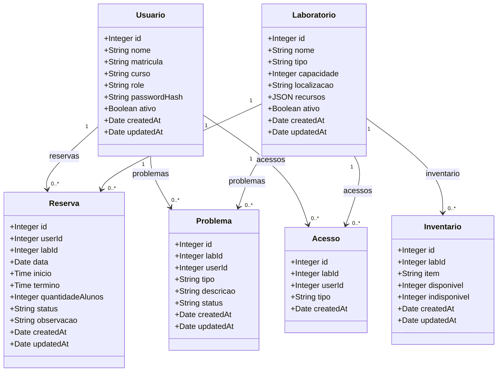

# Diagrama de Classes do domínio

Classes persistentes correspondentes aos Models Sequelize e associações definidas em `backend/src/models/index.js`.

`role`, `passwordHash`, `userId`, `labId` e `quantidadeAlunos` são nomes usados nos Models; Sequelize os mapeia para as colunas SQL `perfil`, `senha_hash`, `usuario_id`, `laboratorio_id` e `quantidade_alunos`, respectivamente. `Acesso` não tem `updatedAt`, de acordo com a tabela `acessos`.
