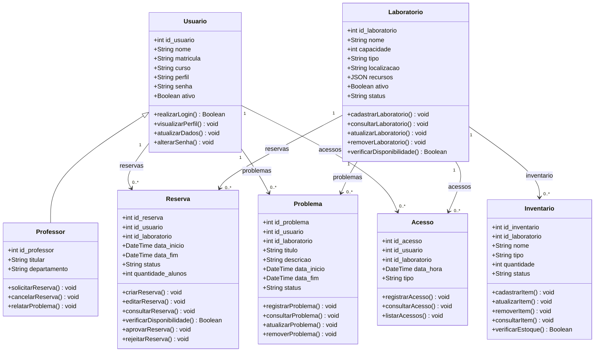

# Diagrama de Classes do domínio

Diagrama atualizado conforme a modelagem de referência do projeto, com atributos, operações e herança de `Professor` para `Usuario`.

```mermaid
classDiagram
    class Usuario {
        +int id_usuario
        +String nome
        +String matricula
        +String curso
        +String perfil
        +String senha
        +Boolean ativo
        +realizarLogin() Boolean
        +visualizarPerfil() void
        +atualizarDados() void
        +alterarSenha() void
    }
    class Professor {
        +int id_professor
        +String titular
        +String departamento
        +solicitarReserva() void
        +cancelarReserva() void
        +relatarProblema() void
    }
    class Reserva {
        +int id_reserva
        +int id_usuario
        +int id_laboratorio
        +DateTime data_inicio
        +DateTime data_fim
        +String status
        +int quantidade_alunos
        +criarReserva() void
        +editarReserva() void
        +consultarReserva() void
        +verificarDisponibilidade() Boolean
        +aprovarReserva() void
        +rejeitarReserva() void
    }
    class Laboratorio {
        +int id_laboratorio
        +String nome
        +int capacidade
        +String tipo
        +String localizacao
        +JSON recursos
        +Boolean ativo
        +String status
        +cadastrarLaboratorio() void
        +consultarLaboratorio() void
        +atualizarLaboratorio() void
        +removerLaboratorio() void
        +verificarDisponibilidade() Boolean
    }
    class Problema {
        +int id_problema
        +int id_usuario
        +int id_laboratorio
        +String titulo
        +String descricao
        +DateTime data_inicio
        +DateTime data_fim
        +String status
        +registrarProblema() void
        +consultarProblema() void
        +atualizarProblema() void
        +removerProblema() void
    }
    class Inventario {
        +int id_inventario
        +int id_laboratorio
        +String nome
        +String tipo
        +int quantidade
        +String status
        +cadastrarItem() void
        +atualizarItem() void
        +removerItem() void
        +consultarItem() void
        +verificarEstoque() Boolean
    }
    class Acesso {
        +int id_acesso
        +int id_usuario
        +int id_laboratorio
        +DateTime data_hora
        +String tipo
        +registrarAcesso() void
        +consultarAcesso() void
        +listarAcessos() void
    }

    Usuario <|-- Professor
    Usuario "1" --> "0..*" Reserva : reservas
    Laboratorio "1" --> "0..*" Reserva : reservas
    Usuario "1" --> "0..*" Problema : problemas
    Laboratorio "1" --> "0..*" Problema : problemas
    Laboratorio "1" --> "0..*" Inventario : inventario
    Usuario "1" --> "0..*" Acesso : acessos
    Laboratorio "1" --> "0..*" Acesso : acessos
```
