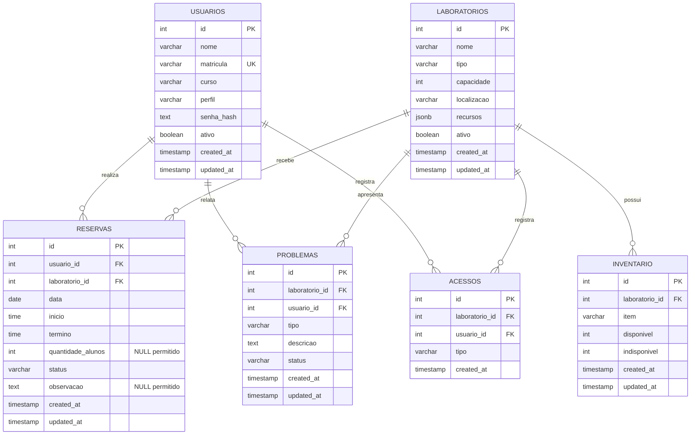

# Modelo Entidade-Relacionamento

MER da aplicação de gestão de laboratórios, derivado de `backend/schema.sql`.

Restrições relevantes: matrícula única; perfil em `admin|professor`; capacidade maior que zero; quantidade de alunos, quando informada, maior que zero; início anterior ao término; status da reserva em `pendente|aprovada|rejeitada|cancelada`; status do problema em `aberto|em_andamento|resolvido`; tipo de acesso em `checkin|checkout`; contagens do inventário não negativas. As FKs usam `NO ACTION` em exclusão e atualização. A tabela `acessos` não possui `updated_at`.
