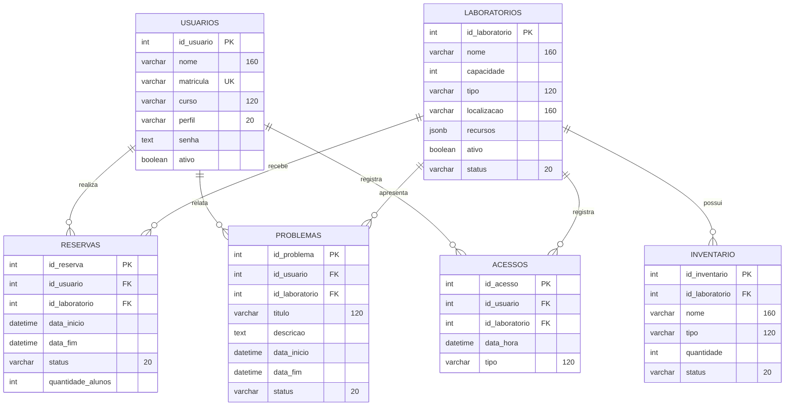

# Modelo Entidade-Relacionamento

MER atualizado conforme a modelagem de referência do projeto.

```mermaid
erDiagram
    USUARIOS ||--o{ RESERVAS : realiza
    LABORATORIOS ||--o{ RESERVAS : recebe
    USUARIOS ||--o{ PROBLEMAS : relata
    LABORATORIOS ||--o{ PROBLEMAS : apresenta
    LABORATORIOS ||--o{ INVENTARIO : possui
    USUARIOS ||--o{ ACESSOS : registra
    LABORATORIOS ||--o{ ACESSOS : registra

    USUARIOS {
        int id_usuario PK
        varchar nome "160"
        varchar matricula UK
        varchar curso "120"
        varchar perfil "20"
        text senha
        boolean ativo
    }
    LABORATORIOS {
        int id_laboratorio PK
        varchar nome "160"
        int capacidade
        varchar tipo "120"
        varchar localizacao "160"
        jsonb recursos
        boolean ativo
        varchar status "20"
    }
    RESERVAS {
        int id_reserva PK
        int id_usuario FK
        int id_laboratorio FK
        datetime data_inicio
        datetime data_fim
        varchar status "20"
        int quantidade_alunos
    }
    PROBLEMAS {
        int id_problema PK
        int id_usuario FK
        int id_laboratorio FK
        varchar titulo "120"
        text descricao
        datetime data_inicio
        datetime data_fim
        varchar status "20"
    }
    ACESSOS {
        int id_acesso PK
        int id_usuario FK
        int id_laboratorio FK
        datetime data_hora
        varchar tipo "120"
    }
    INVENTARIO {
        int id_inventario PK
        int id_laboratorio FK
        varchar nome "160"
        varchar tipo "120"
        int quantidade
        varchar status "20"
    }
```
